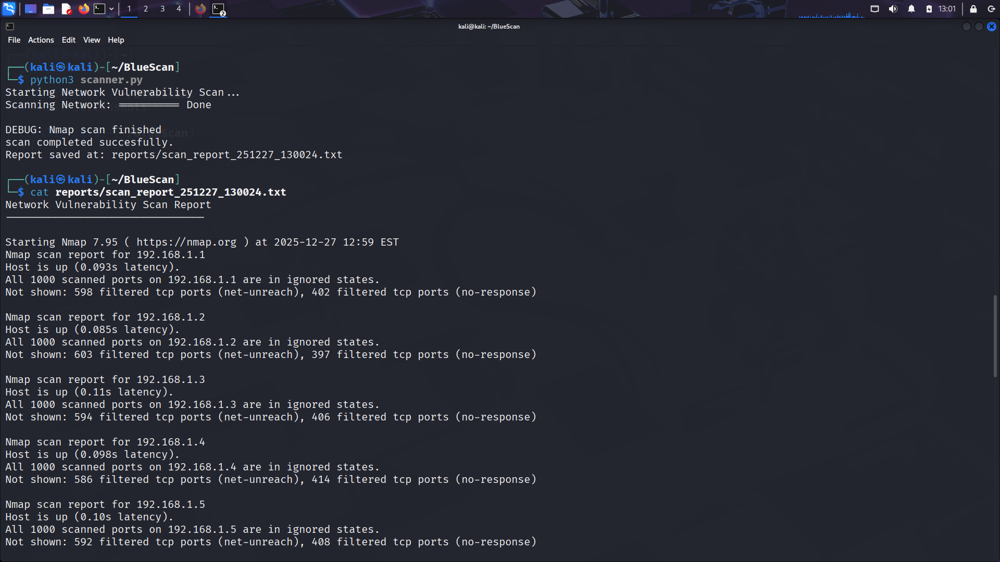
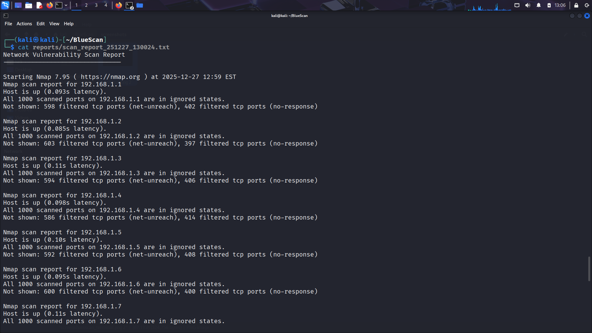

# BlueScan

BlueScan is a simple network Vulnerability scanning project built using Python and Nmap.
it scans a target system or network, identifies running services, and highlights commonly insecure from a blue team perspective

## Features
- Network and Host scanning using Nmap
- Identifies Insecure services such as FTP, Telnet, and HTTP
- Generates timestamped scan reports
- Simple progress indicator
- Beginner Friendly Cybersecurity project

## Tools Used
- Python 3
- Nmap
- Kali Linux

## Project Structure

BlueScan/
|-----scanner.py
|-----reports/
|  |--scan_report_251226_231111.txt
|---README.md

## Screenshot

### Running the scanner

### Sample report

